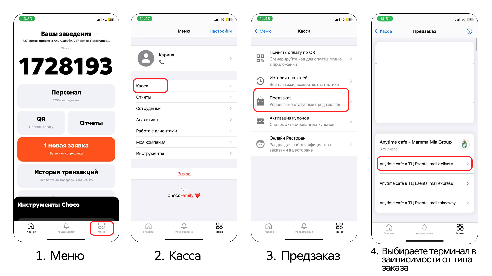
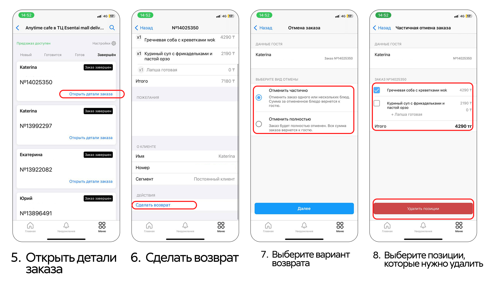
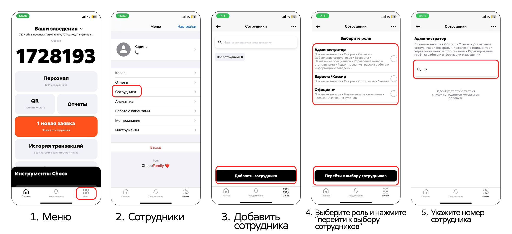
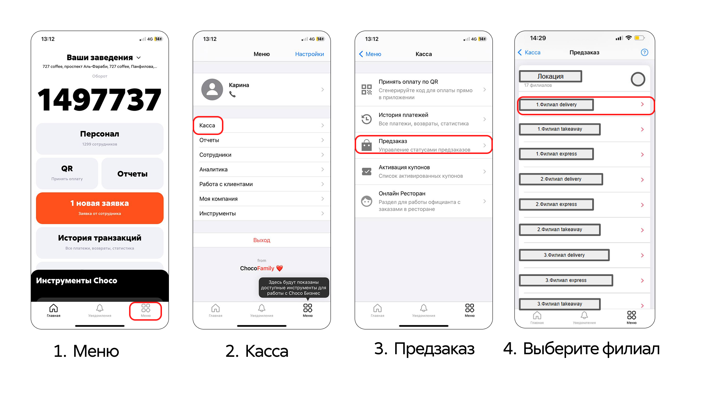
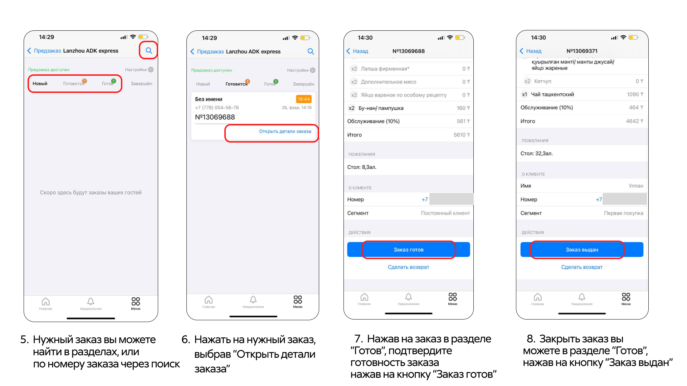
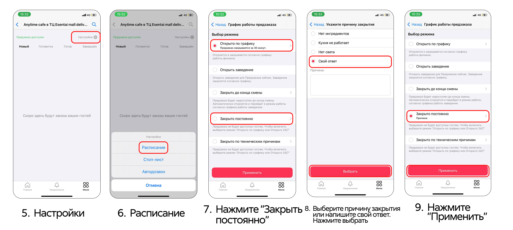
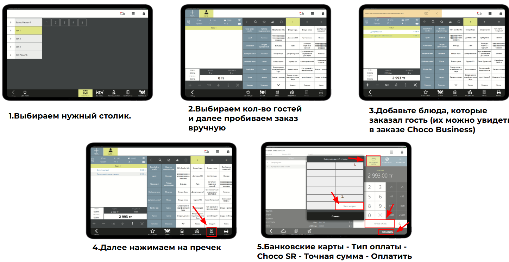

# Для официантов/кассиров

## 1. Инструкция по назначению ротации официантов в ресторане *(на телефоне)*

"Меню" → "Инструменты" → "Столики" → Выбираете ресторан → Нажимаете "Назначить" → Выбираете нужный зал → Выбираете столы для одного официанта → Нажимаете "Далее" → Выбираете официанта и нажимаете "Назначить" → Нажимаете "Подтвердить" → "Готово" → "Закрыть"

.png)
.png)
.png)

---

## 2. Как сделать возврат? *(на телефоне)*

"Меню" → "Касса" → "Предзаказ" → Выбираем нужный раздел (express, takeaway, delivery) → Выбираем нужный заказ → Нажимаем на него → В открывшемся окне видим кнопку "Сделать возврат" → Выбираем частичный или полный возврат → "Удалить позиции"

---

## 3. Как выдать доступ сотруднику? *(на телефоне)*

"Меню" → "Сотрудники" → "Добавить сотрудника" → Выбираем роль администратора → Указываем номер сотрудника → "Добавить"

---

## 4. Как принять заказ вручную? *(на телефоне)*

"Меню" → "Касса" → "Предзаказ" → Выбираем нужный филиал (express, takeaway, delivery) → Выбираем нужный заказ → Нажимаем на него → В открывшемся окне видим состав заказа → Пробиваем его вручную в кассовой системе → Выбираем способ оплаты Choco → Переходим обратно в ChocoБизнес → В открывшимся окне заказа выбираем примерное время готовки заказа → "Принять заказ" → После того как заказ готов нажимаем "Заказ готов" → После того как выдали нажимаем "Заказ выдан".

---

## 5. Как закрыть приём заказов? *(на телефоне)*

"Меню" → "Касса" → "Предзаказ" → Выберите "на терминал в зависимости от типа заказа" → "Настройка" → "Расписание" → Нажмите "Закрыть постоянно" (открыть по графику, открывает локацию) → Выберите "Причину закрытия" или выберите "Свой ответ" → Нажмите "Выбрать" → "Применить"

---

## 6. Как открыть приём заказов? *(на телефоне)*

"Меню" → "Касса" → "Предзаказ" → Выберите "на терминал в зависимости от типа заказа" → "Настройка" → "Расписание" → "Открыть по графику" → Выберите "по графику работы филиала" → Нажмите "Выбрать" → "Применить"

.png)

---

## 7. Как вручную закрыть на тип оплаты Чоко, если оплата не упала в кассу (оплатили через QR)

Выбираем нужный столик → Выбираем кол-во гостей и далее пробиваем заказ вручную → Добавьте блюда, которые заказал гость (их можно увидеть в заказе Choco Business) → Далее нажимаем на пречек → Банковские карты → Тип оплаты → Choco SR → Точная сумма → Оплатить

